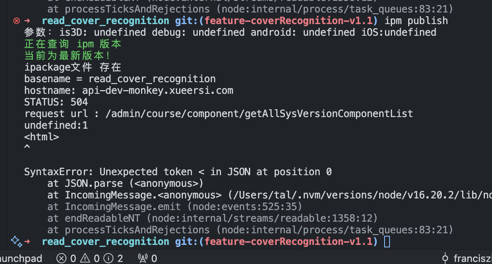

# 小班通用标题修改 6-17
- mb_common_res 已发布线上白名单
- 拖拽模板小猴移植已修改 mb_drag_template		---- 修改人：赵学雄 状态：线上预发中
- 拍照模板 mb_take_photos					---- 修改人：赵学雄 状态：测试环境
- L1-M003-B吸附区拖拽  						---- 修改人：姜海峰 状态：测试环境
- L1-M006-B连线题目							---- 修改人：肖梦刚 状态：测试环境
- 线上发布问题同步
    ```
    通用标题上线问题
    一、背景
	    1.初始方案新增通用标题组件统一包体需求
	    2.但是目前魔镜平台的更新机制暂不支持不存在的通用包动态更新
	    3.需要点击题目发布，题目涉及的数量太多，
    二、问题描述
	    1.魔镜平台操作发布更新会把这个课件创建时依赖的互动都更新
	    2.此课件创建的时候还没上线通用标题组件的话则标题组件不能更新到。
	    3.导致预览加载标题组件失败
    三、变更方案
	    1.取消新增通用标题组件包，改为内置
	    2.使用拖拽模板(小猴移植)，发布测试，然后白名单回归，上线一个验证
	    3.后续其他按照内置的方式修改标题再次发布
	    4.预计周一上午，晚上避免上线
    ```
- 进度沟通


# 发布管理平台访问 502


# 小班班第二批互动循环9个
- TY-L2-M003-1 TY-点击模板 杨勇
- https://yach-doc-shimo.zhiyinlou.com/docs/L9kBMDaYxXCE2WqK/ <TY-点击模板V1prd> 
- C1-L2-M003-8 Q-C1-L2-M003-算式解锁 张顺
- https://yach-doc-shimo.zhiyinlou.com/docs/0l3NVQWQPnipDW3R/ <Q-C1-L2-M003-算式解锁>

# 阅读
## 组课问题跟进线上问题
- 王德凯 慧园
- 组课问题重复提， 目前 ipm 发布阻塞
- 迭代，优先级打低。
## 埋点问题
- 字段不对， bookMode 数值不匹配
- 学雄


