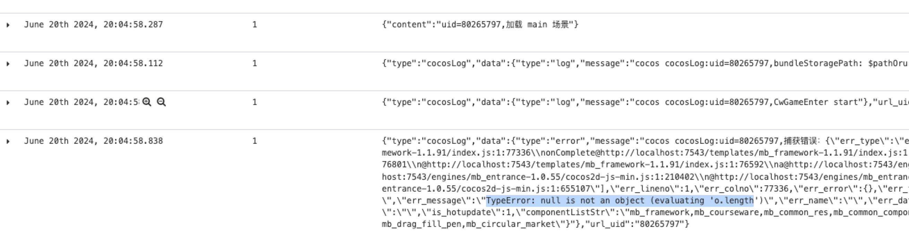
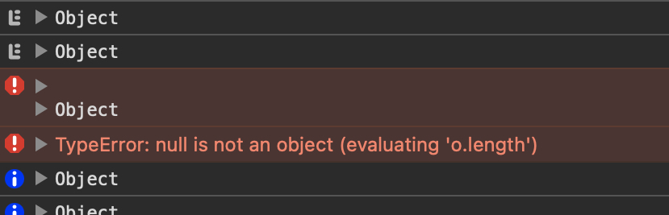
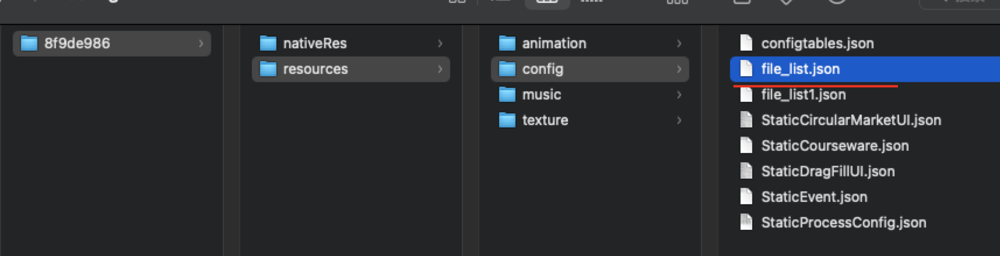

# 小班
## 用标题数值控件
- 跟进鹏鲲进度，今日是否有风险
- 曼玲处于测试中

## 互动开发
- 首批循环开发互动均提测
- 二批待评审排期
- 评审
- 杨勇 点击模板 3+1 天开始时间
- 张顺 拖拽算式 5+1 天开始时间

# 问题展示不了课件
- 本地磁盘文件出问题，无法加载 file_list.json 配置文件
```
Failed to load file_list.json.
当且出现文件内容为空，由于缓存问题，文件正常后导致无法加载最新文件。
```
## 真机无法查看日志，以下为本地模拟客户端运行模式，复现截图
### 用户日志报错信息
- 
### safari 模拟问题截图

### localhost 本地资源截图
- 
### 小结
- 当且仅当磁盘文件出现问题 0kb 大小无文件内容，后续由于缓存机制即便资源正常也无法重载最新文件
- 建议检查本地磁盘文件是否损坏，或者 启动webkit是禁用缓存重新加载。
- 资源不完整不让进课，因为进去必然出问题，以及资源完整后由于缓存，导致无法正常。
<!-- - 兜底机制
- file_list.json 为空时，尝试从远端读取文件内容，需确认是否有参数能拿到远端路径
-  -->
### 目前处理机制
- 客户端
	- 资源异常弹窗提示但是还能进课，切页也会弹窗提示 清除文件重新下载资源
- cocos 课件
	- 检查关键行文件 file_list.json 内容异常后，尝试从远端读取文件内容
	- 需确认是否有参数能拿到远端路径

## 小班组件化设计通讲


## 脚手架
- sso 登录
- 根据链接创建 cocos 工程
- 版本更新
### 组件库权限
- 权限管理
	- 权限申请  刘李静
	- 权限分配  刘李静
	- 权限撤销  刘李静
- 权限分类
	- 按命令分类权限
	- 发布测试 入测试库
	- 发布线上 入正式库
	- 组件状态 state 编辑修改权限
	- 组件安装 查询，下载权限
	- 等

# 阅读
## 组课问题跟进线上问题
- 王德凯 慧园
- 组课问题重复提， 目前 ipm 发布阻塞
- 迭代，优先级打低。
## 埋点问题
- 字段不对， bookMode 数值不匹配
- 学雄
## 新埋点修改
- 宋慧园


# 问题


