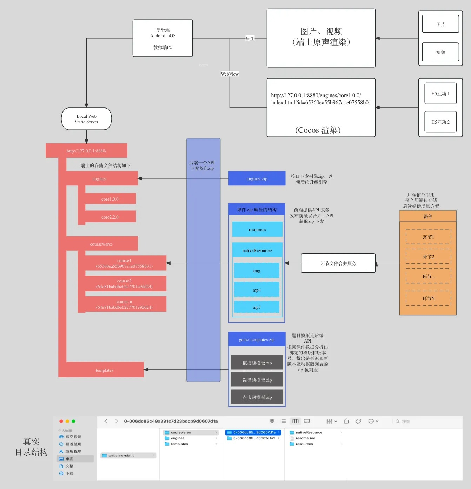

# 课件组件化设计
## 背景
### 课件开发模式过渡
- 独立课程模式
	- 录播直播课以课程为维度，每一个课件都是一个独立的 cocos 工程
	- 开发入手很简单，修改以往的课程就是挨个进cocos工程修改或者拷贝
	- 此阶段由于2.1.3 不支持 ab 包，有修改引擎源码的人更新方案但未采取，等待官方2.4.1 包
- 组件ab包模式
	- 将以往课件的各个模块进行功能拆分，每个模块作为一个组件，然后将这些组件打包成一个ab包，供小猴课件使用
	- 优点：
		- 降低开发难度，只需要修改组件代码即可

### 组件化设计
- 层级图

https://wiki.zhiyinlou.com/display/xiaohouyanfabu/1+MonkeyFramework-font
- 设计思想
```
1.模块化组织结构：
    - 模块化：目的复用、独立单元测试，协同开发，动态拆卸和组装，来完成某种结果表现。
2.代码架构思想
	- 面向数据编程
	- 组件化设计开发，数据驱动
3.具体业务模块 （无论什么业务都采用组合模式实现）
    - 课件业务：app core 实体 + n 个课件相关的业务模块，完成课件业务需求。
	- 交互游戏业务：app core 实体 + n 个游戏功能模块，完成交互游戏任务。
	- 运行时编辑器：app core 实体  + mvvm + 业务模块，完成课件编辑器任务。
	- 其他业务任务......

```

- 组件化应用场景
	- 小猴启蒙热更新录播课
	- 小猴启蒙 3.x 独立游乐场
	- 小猴图书 3.x 录播课 以及 万象编辑器
	- 摩比小班 2.x 直播课 以及 魔镜编辑器


### 组件驱动
- 课件整体运行架构

- 如上图为基本的运行驱动架构
- 新的设计统一了课件驱动方案，无论那个端运行课件都是统一的标准，只有细微差别
- 并在组件模块的设计上支持组件编辑模式
- 以前的老编辑器，都是新写的完全独立于互动，没有任何管理，无法调优


- 真机 本地模式运行结构


- 编辑器驱动 
	- 魔镜再张杰的强烈要求下没有采用 local 模式，采用 h5 + node 文件服务模式
	- 本地运行以及远程运行参数介绍
	- 其中参数文件为魔镜平台打包发布产生
	- 与之前老编辑的最大区别是采用了 cocos 运行时，以及使用运行互动方式就行实现实时编辑。
	
https://wiki.zhiyinlou.com/pages/viewpage.action?pageId=188307357


### 组件更新
- 讨论后决定使用批量发布
https://yach-doc-shimo.zhiyinlou.com/docs/gO3oxWz72yCWo1qD/ <摩境热增量更新方案-最新版>